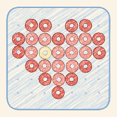

# Pindou · 拼豆图纸

把小红书上的拼豆图纸变成可以直接拿来拼的数字图纸：自动识别格子和 MARD 色号，拼的时候有豆板辅助线，库存、用量和补豆清单也能一起管。

**在线使用：https://emma-zhuym.github.io/pindou/**

这是一个网页 App（PWA），手机和电脑都能用。在 iPhone 上用 Safari 打开，点分享 →"添加到主屏幕"，用起来和普通 App 一样，没网时也能打开。

## 功能

**识别图纸**
- 导入图纸截图或原图，自动找出格子范围、行列数和图例，认出每一格的 MARD 色号。
- 识别结果可以逐步核对：调整图纸范围、确认每个色号、按色号成墙检查格子，和图例上印的颗数对账。
- 可选的 AI 辅助：填入自己的 [OpenRouter](https://openrouter.ai) API Key 后，会让视觉模型读图例上的色号和颗数，并复核没把握的格子。每张图大约 0.002–0.003 美元。

**小红书链接导入**
- 配合 iOS 快捷指令「拼豆读笔记」，在小红书里分享笔记就能列出其中所有图片，选图纸那张导入（正常版或镜像版）。见 [SHORTCUT.md](SHORTCUT.md)。

**图纸库与编辑**
- 未拼 / 在拼 / 已拼三种状态，可以加标签、搜索。
- 编辑工具：画笔、橡皮、吸管、批量换色、撤销；MARD 色卡按色差排出相近颜色。

**拼豆模式**
- 52 / 78 / 104 三种豆板。5 格虚线、10 格实线的辅助线固定在豆板上，图案可以在板上挪动。
- 显示每格色号、高亮单个颜色、标记颜色完成、镜像（熨烫用）、计时、一键标记整张拼完。

**外观和字体**
- 两套外观：仿 iOS 的半透明风格，和纸张风格（米白纸面、乳白液态玻璃、焦糖色）。
- 四种字体：跟随外观、系统字体、文楷打字机（Courier Prime + 霞鹜文楷 Mono）、像素（缝合像素字体）。

**库存与统计**
- 按色号记录库存。补货可以按克（1 克约 100 颗）、按整套补，或导入 CSV。按色系筛选、排序。
- 图纸标成"已拼"时扣库存，改回时可以退回。
- 统计已拼图纸的颗数、用时、速度、每月记录、常用色号。
- 预计消耗：任选几张图纸，对比库存算出预计剩余；生成补豆清单，复制后可以直接粘贴进 Excel。

## 数据与隐私

- 图纸、库存和设置都只存在你自己的浏览器里（IndexedDB），没有服务器，也不用登录。
- 可以在设置里导出备份文件，换设备或换浏览器时再恢复。
- 只有开启 AI 辅助时，才会把图例和格子的裁剪小图发给 OpenRouter，用的是你自己的 Key。
- 读取小红书笔记时不登录、不用 Cookie，一次只读一条你主动分享的笔记。
- 用「文楷打字机」字体时，会从 jsDelivr 下载字体文件（只下载页面上用到的字）。

## 本地开发

需要 Node.js 22 和 pnpm。

```bash
cd app
pnpm install
pnpm dev       # 开发服务器（带本地的小红书链接中转）
pnpm build     # 打包到 app/dist
pnpm lint
```

识别引擎的回归测试在 `app/tests/`，用 `npx tsx tests/<名字>.ts` 运行。测试用的图纸样图是别人的作品，不包含在仓库里，需要自己准备并放到 `samples/`。

### 目录

| 路径 | 内容 |
|---|---|
| `app/src/engine/` | 识别引擎：找格子、读图例、给格子定色号。纯计算，不依赖浏览器 |
| `app/src/flow/` | 识别流程：导入、范围校准、色号确认、核对、保存 |
| `app/src/bead/`、`app/src/edit/` | 拼豆模式、编辑工具和色卡 |
| `app/src/stock/`、`app/src/stats/` | 库存、补货、预计消耗、补豆清单、统计 |
| `app/src/store.ts` | 本地存储（IndexedDB）和备份 |
| `app/src/ai.ts` | 可选的 AI 读图（OpenRouter） |
| `app/src/xhsNote.ts` | 从小红书笔记页面读出图片列表 |
| `app/relay/` | 开发服务器上的链接中转 |
| `shortcut/` | 生成并签名「拼豆读笔记」快捷指令 |
| `research/` | 最早的 Python 识别原型 |

推送到 `main` 后，GitHub Actions 会打包并发布到 GitHub Pages（`.github/workflows/pages.yml`）。

## 协议与致谢

- 本项目以 [AGPL-3.0](LICENSE) 发布。
- MARD 色卡数据来自 [Zippland/perler-beads](https://github.com/Zippland/perler-beads)（AGPL-3.0）。
- 字体：[缝合像素字体 Fusion Pixel Font](https://github.com/TakWolf/fusion-pixel-font)（SIL OFL 1.1，随应用打包，协议见 `app/src/fonts/`）；[霞鹜文楷 Mono](https://github.com/lxgw/LxgwWenKai) 和 [Courier Prime](https://quoteunquote.com/courier-prime/)（均为 SIL OFL 1.1，从 jsDelivr 加载）。
- 图标是用代码一笔一笔画的蜡笔画（`app/tools/crayon-icon.ts`）。
- 屏幕上的颜色只是近似，以实物豆子为准。
- 本项目是个人项目，与 MARD、小红书没有关系。
